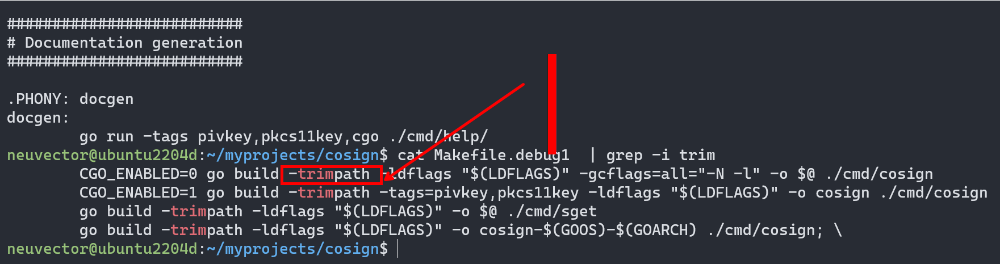
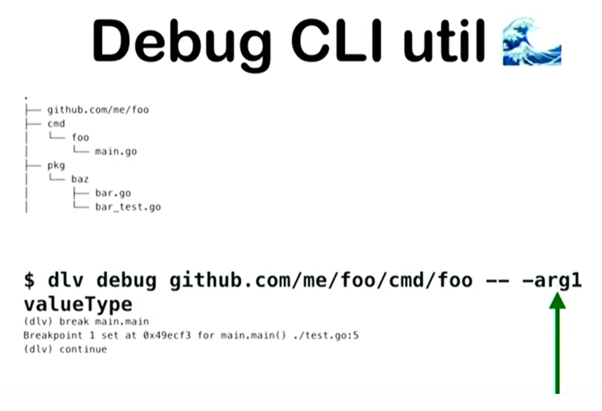
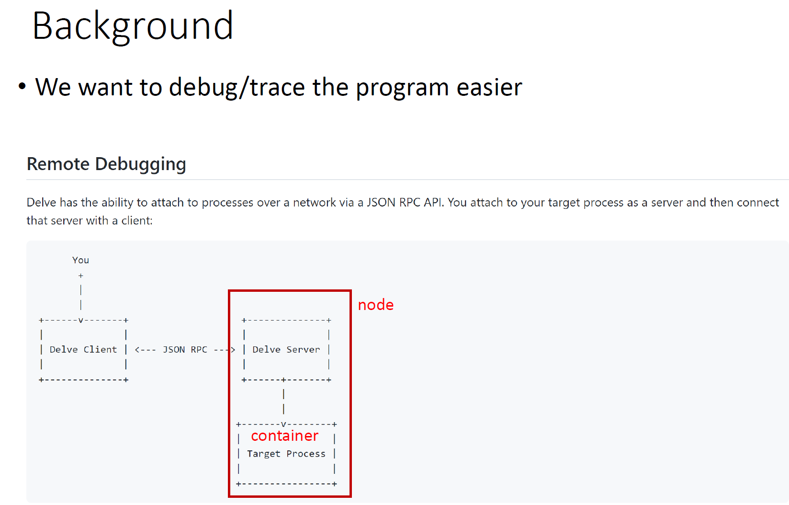

# Delve debugging

## Tip 1 - debug build flags

- Need to use debug flags
```
neuvector@labubt18srv1:~/go/src/github.com/neuvector/neuvector/controller$ cat Makefile
all:
        # go build --ldflags '-extldflags "-static"'
        # go build -ldflags='-s -w'     # release build
        go build -gcflags=all="-N -l"   # debug build
```

- When build the program for dlv debugging, besides adding the `-gcflags`, we need to remove the `-trimpath` option , otherwise the dlv cannot find the path...   
Some open source project will include this.

<p align="center">

</p>

## Tip 2 - pass parameter to CLI progrm
When you want to debug CLI and pass parameter.   
👉 [Video intro](https://www.youtube.com/watch?v=2kjmLQY8RJk&t=61s&ab_channel=PeterCooper)

Example:
```
neuvector@ubuntu2204d:~/myprojects/cosign$ cat 1_dlv_exec.sh
# remember to remove -trimpath build the binary
# (dlv) b main.main
# (dlv) c
# =>  36: func main() {
#     37:         // Fix up flags to POSIX standard flags.
#     38:         ctx := context.Background()
#
# >>> another good point here..
# 1  0x0000000000871b4d in github.com/spf13/cobra.(*Command).execute   // ****** we can set breakpoint here..
#
dlv exec cosign -- triangulate chihjenhuang/cosign1:t1
```

<p align="center">

</p>

## Tip 3 - debug container running in k8s

<p align="center">

</p>


👉 [Notes in PDF](../documents/delve_debugger_v2.pdf)