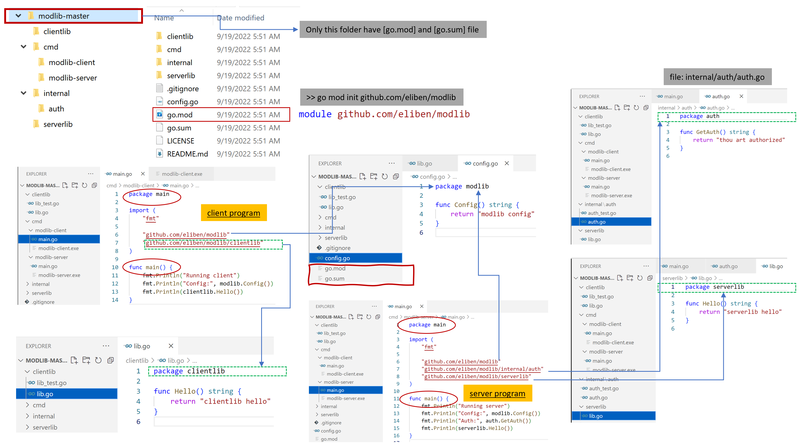

# Golang related stuff

## Go project layout, modules

[Simple Go project layout with modules](https://eli.thegreenplace.net/2019/simple-go-project-layout-with-modules/)

<p align="center">

</p>

## Golang Resources - part 1

[Go101](https://go101.org/article/101.html)  
[Go101 - Interfaces in Go](https://go101.org/article/interface.html)  
[Go101 - Channels in Go](https://go101.org/article/channel.html)   
[Go101 - Goroutines, Deferred Function Calls and Panic/Recover](https://go101.org/article/control-flows-more.html)   
[Go101 - Go Tips 101](https://go101.org/article/tips.html)  
[Effective Go, book](https://github.com/golovers/effective-go0)  
[Effective Go](https://go.dev/doc/effective_go)  
[Uber Golang style guide](https://github.com/uber-go/guide/blob/master/style.md)  
[Go (Golang) coding guidelines](https://wiki.crdb.io/wiki/spaces/CRDB/pages/181371303/Go+Golang+coding+guidelines)

## Golang Resources - part 2

[Debugging concurrency programs in Go](https://www.youtube.com/watch?v=D_S9qQ7jzkQ&ab_channel=AndriiSoldatenko)
```
    debug channel
    dlv goroutine
    profile labels
    goroutine label
    detect deadlock
```

[Profiling and Execution Tracing in Go](https://teivah.medium.com/profiling-and-execution-tracing-in-go-a5e646970f5b)   
[gRPC YouTube video series](https://www.youtube.com/playlist?list=PLmD8u-IFdreyyTx93jJ5GkijwDXFqyr3T)   
[Golang programming series](https://www.youtube.com/playlist?list=PL64wiCrrxh4Jisi7OcCJIUpguV_f5jGnZ)   