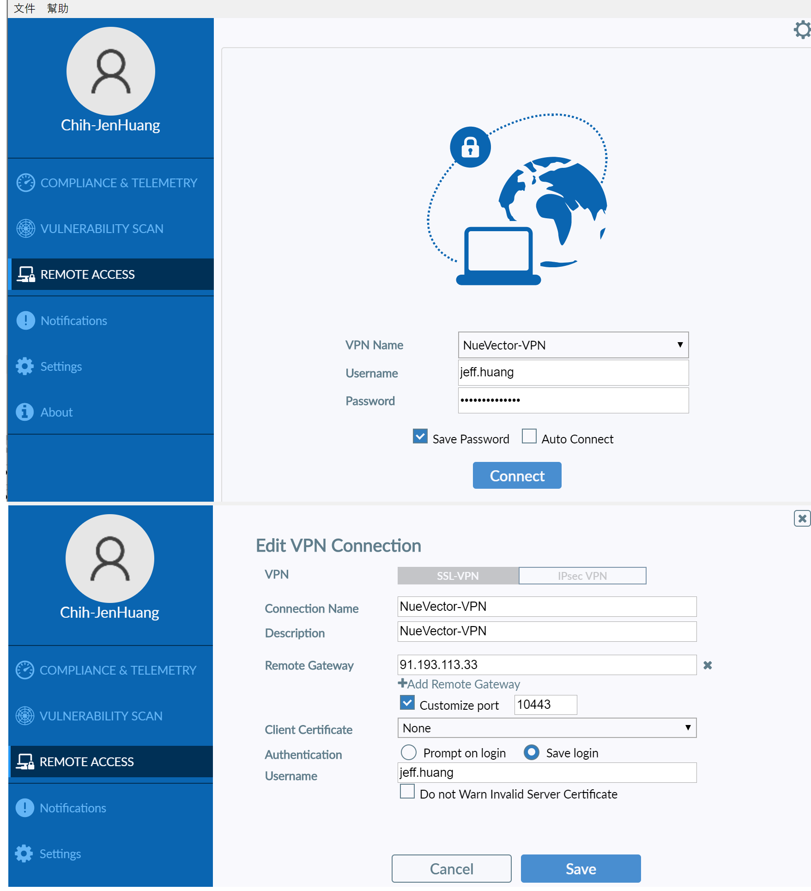

# neuvector daily development notes


## Environment
```
Jira
https://jira.suse.com/browse/NVSHAS-4978?filter=-1

Docker registry for neuvector
https://hub.docker.com/r/nvpublic/al/tags

Jenkins (controller part)
http://10.1.127.7:8081/view/build-core/job/nv-build-fleet/

Jenkins (manager part)
http://10.1.127.7:8081/view/build-core/job/nv-build-manager/
```

## VPN
```
software: FortiClient
```

<p align="center">

</p>

## Submit support case
- TODO

## CloudFront portal
- TODO

## git branch
```
git checkout -b case123
... do code modification...
git add 
git commit 
git push origin case123
goes to github and create PR
```

## Jira case handling
After submit PR, change the case status to `in review`.   
After PR is merged, change the case status to `resolved`.   