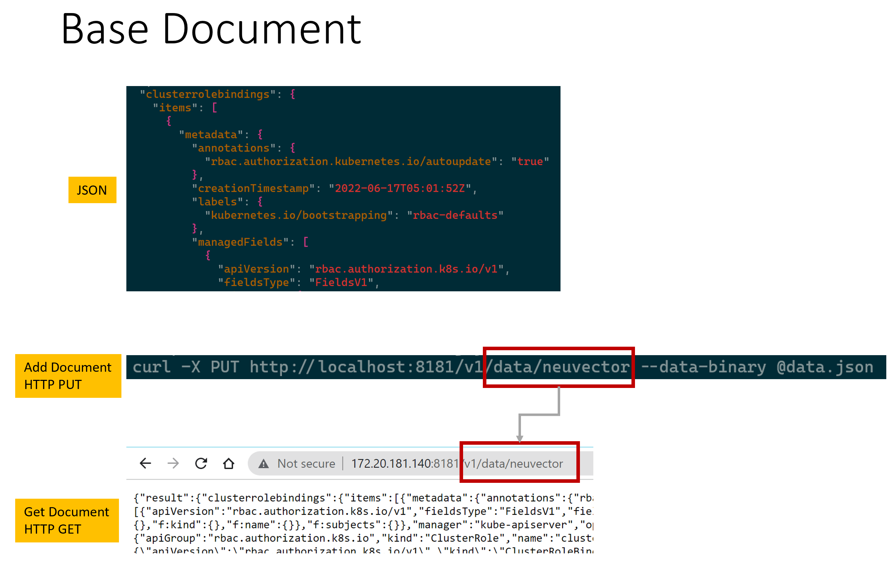
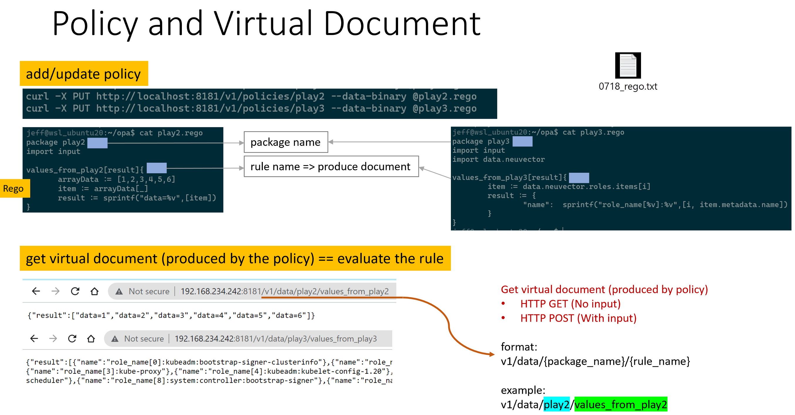
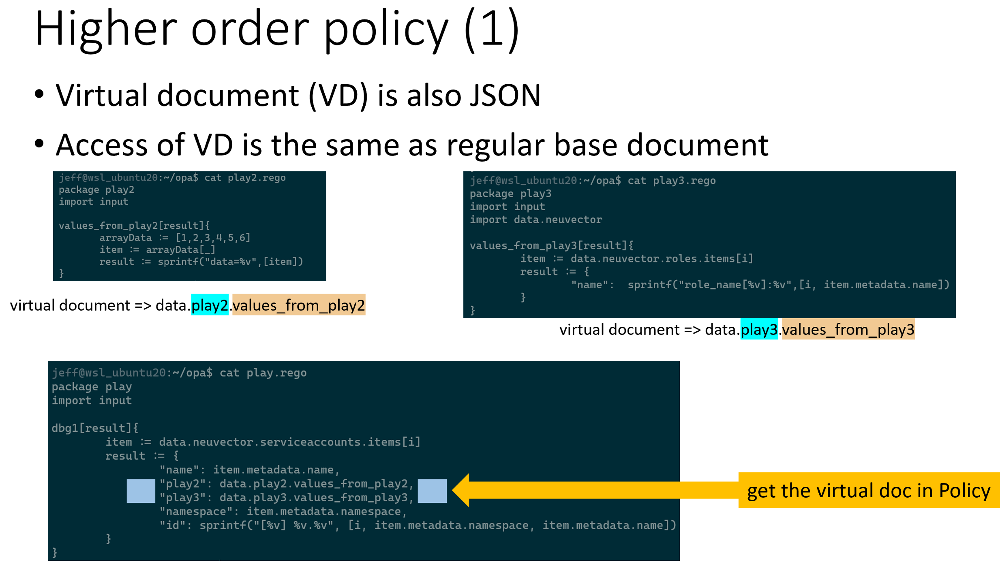

# OPA and Rego usage

## start opa
```
neuvector@ubuntu2204d:~/opa$ cat 1_start_opa.sh
echo "visit opa server at http://10.1.45.43:8181/v1/data"
opa run --server --ignore=.* --addr=:8181 &
```

## start opa with TLS
TODO: add steps to generate the cert
```
// start opa with TLS
opa run --server --log-level debug --tls-cert-file public.crt --tls-private-key-file private.key --addr=:8181
```

## add document to opa and read it back

```
// prepare a JSON doc
neuvector@ubuntu2204d:~/opa$ cat allpods.json | more
{
  "kind": "PodList",
  "apiVersion": "v1",
  "metadata": {
    "resourceVersion": "1515575"
  },
  "items": [
    {
      "metadata": {
        "name": "coredns-558bd4d5db-42sp2",


// add it via HTTP PUT 
// 👉 note the /v1/data part is fixed, and the nvdig/k8s/pods is we defined.
neuvector@ubuntu2204d:~/opa$ curl -X PUT http://localhost:8181/v1/data/nvdig/k8s/pods --data-binary @allpods.json


// read it back via HTTP GET
neuvector@ubuntu2204d:~/opa$ curl http://localhost:8181/v1/data/nvdig/k8s
{"result":{"pods":{"apiVersion":"v1","items":[{"metadata":{"creationTimestamp":"2022-11-09T07:18:44Z","generateName"

neuvector@ubuntu2204d:~/opa$ curl http://localhost:8181/v1/data/nvdig/k8s/pods
{"result":{"apiVersion":"v1","items":[{"metadata":{"creationTimestamp":"2022-11-09T07:18:
```

## using rego policy
   - rego read data
   - rego read input (parameter)
   - add rego to opa
   - evaluate rego without input, using `HTTP GET`
   - evaluate rego with input, using `HTTP POST`

```
// prepare json ocument
neuvector@ubuntu2204d:~/ui_pagination$ cat scan_asset.json | more
{"images":{"04e76930489d14c119ca555bcdabcd124819f5302e5403e723d6e2500fceefd

// add document to opa, note the /v1/data URL fragment
neuvector@ubuntu2204d:~/ui_pagination$ curl -X PUT http://localhost:8181/v1/data/asset --data-binary @scan_asset.json

// read it back via
neuvector@ubuntu2204d:~/ui_pagination$ curl http://localhost:8181/v1/data/asset
neuvector@ubuntu2204d:~/ui_pagination$ curl http://localhost:8181/v1/data/asset/images
```

A simple rego policy,
 👉 to read from data, it's in `data`
 👉 to read from user's input, it's in `input`

```
neuvector@ubuntu2204d:~/opa$ cat play1.rego
package playtest

test[msg]{
    soruce:=["value1","value2","value3"]
    d:=soruce[i]
    msg := sprintf("%v=%v",[i,d])
}

test2[msg]{
    onepod := data.nvdig.k8s.pods.items[i] 👈
    msg := sprintf("%v",[onepod.metadata.name])
}

test3[msg]{
    # record := /v1/data/asset/vulnerabilities
    record := data.asset.vulnerabilities[i] 👈  # data == curl http://localhost:8181/v1/data/asset/vulnerabilities
    msg := sprintf("%v=%v",[i,record.name])
}

test3a[msg]{
    record := data.asset.vulnerabilities[i]
    record.name=="CVE-2019-25013"   👈
    msg := record
}

test4[msg]{
        # read from input (via HTT POST)
        item:=input.filters[i]      👈  # this comes from user's HTTP POST as input parameter
        msg := sprintf("%v=%v",[i,item])
}

images[msg]{
    record := data.asset.images[i]  👈  # data == curl http://localhost:8181/v1/data/asset/images
    msg:=record
}

findImageById[msg]{
    image_id:=input.image_id
    images:=data.asset.images[image_id]
    oneImage:=images[i]
    msg:= sprintf("%v",[oneImage.display_name])
}

findHighRiskVulnerabilities[msg]{
    record := data.asset.vulnerabilities[i]
    record.score_v3 > 9.0          👈  do filtering based on user's input parameter...
    msg := sprintf("%v=%v, score_v3=%v",[i,record.name, record.score_v3])
}
```

Add policy to opa, 👉 note the `/v1/policies` URL
```
neuvector@ubuntu2204d:~/opa$ cat 2_apply_rego.sh
curl -X PUT http://localhost:8181/v1/policies/play --data-binary @play1.rego
```

👉 Evaluate rule, without input parameter => using `HTTP GET`
```
// 👉 format for the URL :  /v1/data/{package_name}/{rule_name}
neuvector@ubuntu2204d:~/opa$ curl http://localhost:8181/v1/data/playtest/test
{"result":["0=value1","1=value2","2=value3"]}
```

👉 Evaluate rule, provide input as parameter => using `HTTP POST`
```
neuvector@ubuntu2204d:~/opa$ cat query_filter.json
{
        "input": {
                "filters": ["op-1", "op-2", "op-3"],
                "image_id": "c905cfac2f217dc7bcf9a4aeda3f167857396199eb538c7e9309dcb09f211b7c"
        }
}

neuvector@ubuntu2204d:~/opa$ curl -X POST http://localhost:8181/v1/data/playtest/test4 --data-binary @query_filter.json
{"result":["0=op-1","1=op-2","2=op-3"]}
neuvector@ubuntu2204d:~/opa$
```

## some diagrams

<p align="center">

</p>

<p align="center">

</p>

<p align="center">

</p>

<p align="center">

</p>
