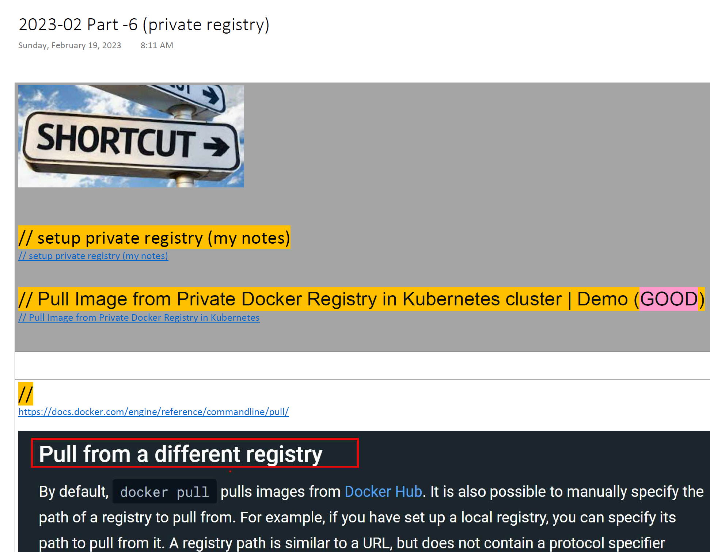

## Private registry 

### to access a private registry as a client
1. modify /etc/hosts,   
```
10.1.45.50 labk.neuvector.com
```

2. copy certificate to the folder belong to the host
```
sudo mkdir -p /etc/docker/certs.d/labk.neuvector.com/
sudo scp neuvector@10.1.45.50:/etc/docker/certs.d/labk.neuvector.com/domain.crt /etc/docker/certs.d/labk.neuvector.com/
```

3. docker login
```
docker login labk.neuvector.com  
```

4. docker pull
```
docker pull labk.neuvector.com/nginx
```

### Full notes

👉👉👉 [Full notes](../documents/private_registry.pdf)

<p align="center">

</p>
