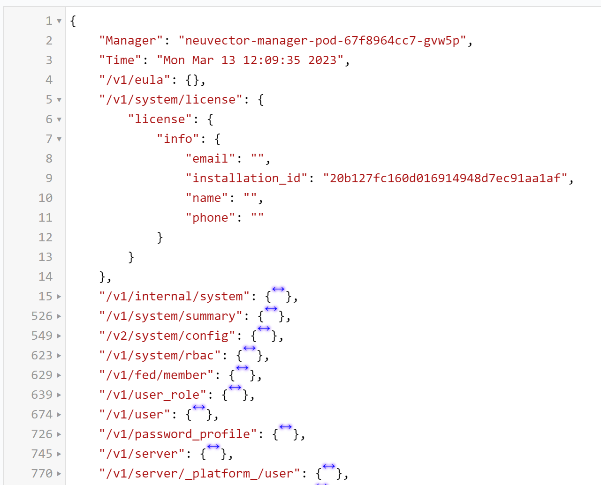

# import json file into sqlite automatically

## tool sqlite-util 

- [sqlite-utils, intro](https://jvns.ca/blog/2022/05/12/sqlite-utils--a-nice-way-to-import-data-into-sqlite/)

## example

```
// use jq to view json
neuvector@ubuntu2204d:~/tmp$ cat simple.json | jq '.["/v1/system/license"]'

neuvector@ubuntu2204d:~/tmp$ cat simple.json | jq '.["/v1/log/activity"]'
neuvector@ubuntu2204d:~/tmp$ cat simple.json | jq '.["/v1/log/activity"].events'

neuvector@ubuntu2204d:~/tmp$ cat simple.json | jq '.["/v1/log/activity"].events | length'
3

// export to sqlite
neuvector@ubuntu2204d:~/tmp$ cat simple.json | jq '.["/v1/log/activity"].events' | sqlite-utils insert events.db events -

// the db and schema is create automatically 
neuvector@ubuntu2204d:~/tmp$ sqlite3 events.db
SQLite version 3.37.2 2022-01-06 13:25:41
Enter ".help" for usage hints.
sqlite> .schema
CREATE TABLE [eventss] (
   [action] TEXT,
   [aggregation_from] INTEGER,
   [cluster_name] TEXT,
   [count] INTEGER,
   [enforcer_id] TEXT,
   [enforcer_name] TEXT,
   [host_id] TEXT,
   [host_name] TEXT,
   [id] TEXT,
   [level] TEXT,
   [message] TEXT,
   [name] TEXT,
   [proc_cmd] TEXT,
   [proc_effective_uid] INTEGER,
   [proc_effective_user] TEXT,
   [proc_name] TEXT,
   [proc_parent_name] TEXT,
   [proc_path] TEXT,
   [proc_real_uid] INTEGER,
   [proc_real_user] TEXT,
   [reported_at] TEXT,
   [reported_timestamp] INTEGER,
   [rule_id] TEXT,
   [group] TEXT,
   [proc_parent_path] TEXT,
   [workload_domain] TEXT,
   [workload_id] TEXT,
   [workload_image] TEXT,
   [workload_name] TEXT,
   [workload_service] TEXT
);


// view it
neuvector@ubuntu2204d:~/tmp$ sqlite3 events.db
SQLite version 3.37.2 2022-01-06 13:25:41
Enter ".help" for usage hints.
sqlite> .tables
eventss
sqlite> select * from events;
```

## json example

<details><summary>view raw json</summary>

```json
neuvector@ubuntu2204d:~/tmp$ cat simple.json
{
        "Manager": "neuvector-manager-pod-67f8964cc7-gvw5p",
        "Time": "Mon Mar 13 12:09:35 2023",
        "/v1/eula": {},
        "/v1/system/license": {
                "license": {
                        "info": {
                                "email": "",
                                "installation_id": "20b127fc160d016914948d7ec91aa1af",
                                "name": "",
                                "phone": ""
                        }
                }
        },
        "/v1/log/activity": {
                "events": [{
                                "action": "violate",
                                "aggregation_from": 1678709311,
                                "cluster_name": "cluster.local",
                                "count": 1,
                                "enforcer_id": "e8b7859443f02ebb7e2459a9f0779dc3bd99e67465ce67fb754ec53faaa2c5ff",
                                "enforcer_name": "neuvector-enforcer-pod-jz2wv",
                                "host_id": "cpworker-dexu-01.wwk-group.com:LZPF:XRLQ:EVGL:G2J2:MHQJ:ECAT:Z223:MXPU:URTH:JV2J:HFCO:QFKA",
                                "host_name": "cpworker-dexu-01.wwk-group.com",
                                "id": "ab3fcc6c-3d0f-4226-80ea-dfe3ffa22cd0",
                                "level": "Critical",
                                "message": "Unauthorized root privilege escalation!",
                                "name": "Host.Privilege.Escalation",
                                "proc_cmd": "bash -c /home/nagios/lib/nagios/plugins/check_unixprocesses cpworker-dexu-01",
                                "proc_effective_uid": 40024,
                                "proc_effective_user": "nagios",
                                "proc_name": "bash",
                                "proc_parent_name": "sshd",
                                "proc_path": "/usr/bin/bash",
                                "proc_real_uid": 40024,
                                "proc_real_user": "nagios",
                                "reported_at": "2023-03-13T12:08:58Z",
                                "reported_timestamp": 1678709338,
                                "rule_id": "00000000-0000-0000-0000-000000000003"
                        },
                        {
                                "action": "violate",
                                "aggregation_from": 1678709334,
                                "cluster_name": "cluster.local",
                                "count": 1,
                                "enforcer_id": "e8b7859443f02ebb7e2459a9f0779dc3bd99e67465ce67fb754ec53faaa2c5ff",
                                "enforcer_name": "neuvector-enforcer-pod-jz2wv",
                                "group": "nv.argocd-applicationset-controller.argocd",
                                "host_id": "cpworker-dexu-01.wwk-group.com:LZPF:XRLQ:EVGL:G2J2:MHQJ:ECAT:Z223:MXPU:URTH:JV2J:HFCO:QFKA",
                                "host_name": "cpworker-dexu-01.wwk-group.com",
                                "id": "113aaa22-85ee-4236-be57-66e615d93887",
                                "level": "Warning",
                                "message": "Risky application: ssh to remote",
                                "name": "Container.Suspicious.Process",
                                "proc_cmd": "ssh -i /dev/shm/2324112673 -o StrictHostKeyChecking=yes -o UserKnownHostsFile=/app/config/ssh/ssh_known_hosts -o SendEnv=GIT_PROTOCOL -p 7999 git@bitbucket.infra.ecp.wwk-group.com git-upload-pack '/wwkcp/argocd-system-tools.git'",
                                "proc_effective_uid": 999,
                                "proc_effective_user": "argocd",
                                "proc_name": "ssh",
                                "proc_parent_name": "sh",
                                "proc_parent_path": "/usr/bin/dash",
                                "proc_path": "/usr/bin/ssh",
                                "reported_at": "2023-03-13T12:08:54Z",
                                "reported_timestamp": 1678709334,
                                "rule_id": "00000000-0000-0000-0000-000000000001",
                                "workload_domain": "argocd",
                                "workload_id": "c70b54da538e408130ef1bed038735fdf645c8d4237a72bbeab44c7cef2a786e",
                                "workload_image": "registry.wwk-group.com/iaas-docker/argoproj/argocd:v2.6.3",
                                "workload_name": "argocd-applicationset-controller-5799c8844-2dbjm",
                                "workload_service": "argocd-applicationset-controller.argocd"
                        },
                        {
                                "action": "violate",
                                "aggregation_from": 1678709327,
                                "cluster_name": "cluster.local",
                                "count": 1,
                                "enforcer_id": "35c30f5aa6b2568510ef5947e9c751773507009cbc190fc6910f36ead640877a",
                                "enforcer_name": "neuvector-enforcer-pod-6zhdm",
                                "host_id": "cpmaster-dexu-01.wwk-group.com:ITGQ:W7YO:NFQN:TBJP:EKPB:DVKZ:DLDT:RBG4:3FBH:WEVL:4IIF:5HZN",
                                "host_name": "cpmaster-dexu-01.wwk-group.com",
                                "id": "6ddc101d-c57c-49ba-91fa-9bc977d911ad",
                                "level": "Critical",
                                "message": "Unauthorized root privilege escalation!",
                                "name": "Host.Privilege.Escalation",
                                "proc_cmd": "bash -c /home/nagios/lib/nagios/plugins/check_fslimit cpmaster-dexu-01",
                                "proc_effective_uid": 40024,
                                "proc_effective_user": "nagios",
                                "proc_name": "check_fslimit",
                                "proc_parent_name": "sshd",
                                "proc_path": "/usr/bin/bash",
                                "proc_real_uid": 40024,
                                "proc_real_user": "nagios",
                                "reported_at": "2023-03-13T12:08:47Z",
                                "reported_timestamp": 1678709327,
                                "rule_id": "00000000-0000-0000-0000-000000000003"
                        }
                ]
        }
}
```


--- 

<p align="center">

</p>

</details>


## some diagrams

<p align="center">

</p>

--- 

<p align="center">

</p>

