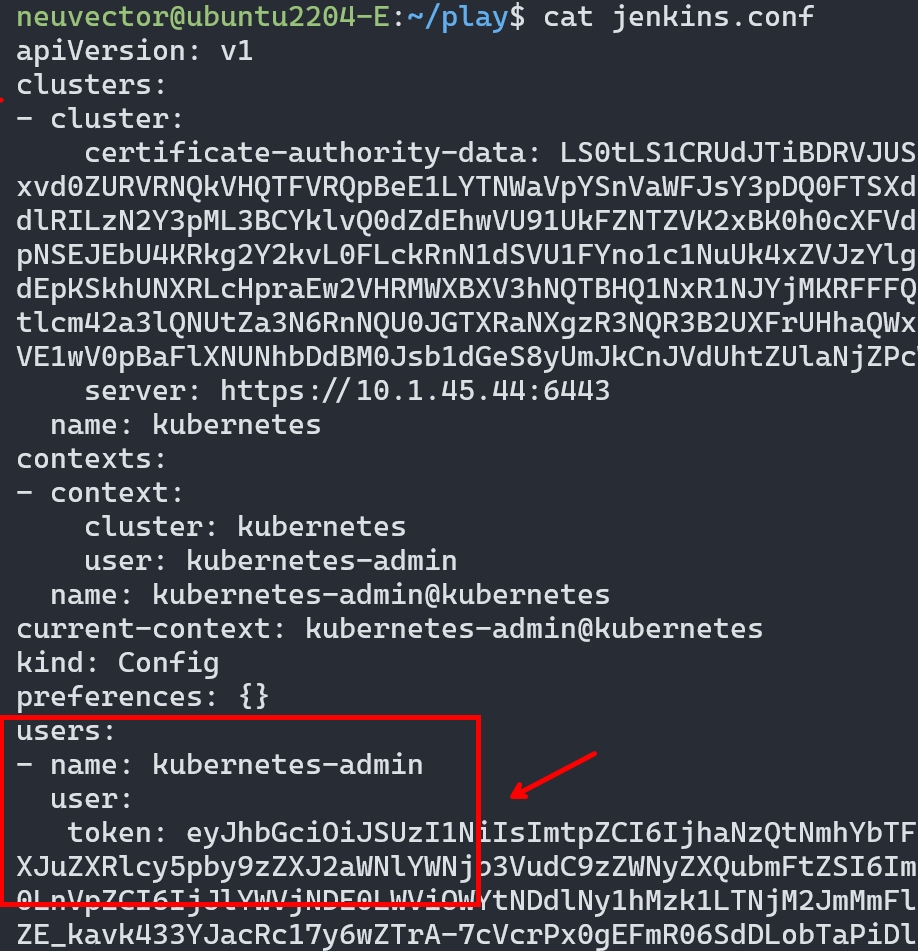

## User ServiceAccount in kube config

:warning:
Since k8s 1.24, the command `kubectl create serviceaccount` doesn't create a token. You need to create it with additional kubectl create token command


## Steps (use default namespace)

1. create Service Account
```
kubectl create serviceaccount jenkins --dry-run=client -o yaml > jenkins-sa.yaml
kubectl apply -f jenkins-sa.yaml
```

2. (for k8s 1.23 and earlier) get the secret id belong to this Service Account 
```
neuvector@ubuntu2204-E:~/play$ kubectl describe serviceaccount jenkins
Name:                jenkins
Namespace:           default
Labels:              <none>
Annotations:         <none>
Image pull secrets:  <none>
Mountable secrets:   jenkins-token-pfjsb    👈👈👈
Tokens:              jenkins-token-pfjsb    
Events:              <none>
```

3. (for k8s 1.24 and later) create token to this Service Account  :hammer: 
```
TODO:
```

4. (for k8s 1.23 and earlier) get the token 
```
neuvector@ubuntu2204-E:~/play$ kubectl get secret jenkins-token-pfjsb -oyaml
apiVersion: v1
data:
  ca.crt: LS0tLS1CRUdJTiBDRVJUSUZJQ0FURS0tLS0tCk1JSUM1ekNDQW..==
  namespace: ZGVmYXVsdA==
  token: ZXlKaGJHY2lPaUpT..HB3      👈👈👈
kind: Secret
metadata:
  annotations:
    kubernetes.io/service-account.name: jenkins
    kubernetes.io/service-account.uid: 2eaec414-eb9f-47e7-a395-3c3bf2ae0116
  creationTimestamp: "2023-02-02T04:12:37Z"
  name: jenkins-token-pfjsb
  namespace: default
  resourceVersion: "10331246"
  uid: ea1cca01-5c65-4d0d-b210-f9b59b261dca
type: kubernetes.io/service-account-token
```

5. (for k8s 1.24 and later) get the token :hammer:
```
TODO:
```

6. decode the token and save the decoded base64 string
```
// the token is base64 encoded
echo ZXlKaGJHY2lPaUpTVXpJMU5pSXNJbXRwWkNJNkl...  | base64 --decode

eyJhbGciOiJSUzI1NiIsImtpZCI6IjhaNzQtNmhYbTFnVXpaVzhITk9tcUUwV0RDcX....  👈👈👈 (we need this)
```

7. copy from an kubeconfig file to a new one
```
cp ~/.kube/config jenkins.conf
```

8. put the token in the `jenkins.conf`
```
users:
- name: kubernetes-admin
  user:
   token: eyJhbGciOiJSUzI1NiIsImtpZCI6IjhaNzQtNmhYbTFn...
```

<p align="center">

</p>

9. give it a try
```
kubectl --kubeconfig jenkins.conf get pod

// output is permission denied, this is expected as we don't give rbac yet.
neuvector@ubuntu2204-E:~/play$ kubectl --kubeconfig jenkins.conf get pod
Error from server (Forbidden): pods is forbidden: User "system:serviceaccount:default:jenkins" cannot list resource "pods" in API group "" in the namespace "default"
```

10. give permission (RBAC)
```
// create role (add namespace if it's not default)
kubectl create role cicd-role --verb=create,update,list --resource=deployments.apps,services --dry-run=client -o yaml > cicd-role.yaml
kubectl apply -f cicd-role.yaml

// create binding
kubectl create rolebinding cicd-binding --role=cicd-role --serviceaccount=default:jenkins --dry-run=client -o yaml > cicd-binding.yaml
kubectl apply -f cicd-binding.yaml
```

11. :grinning: Test
```
kubectl auth can-i create service --as system:serviceaccount:default:jenkins -n default
(expect yes)

kubectl auth can-i get pod --as system:serviceaccount:default:jenkins -n default
(expect no)

# now we can use the jenkins.conf
neuvector@ubuntu2204-E:~/play$ kubectl --kubeconfig jenkins.conf get deployments  🔑🔑🔑
No resources found in default namespace.
```

